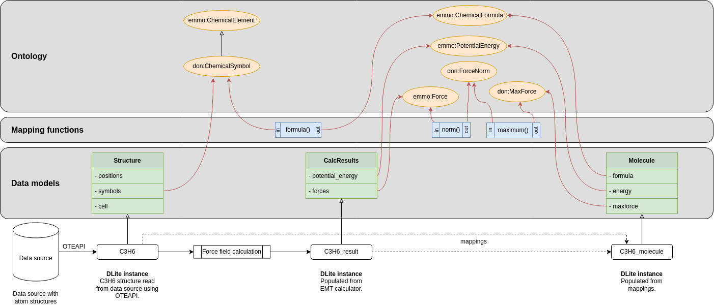

Semantic transformations.

### Domain

Any applied scientific domain dealing with semantic data.

### Purpose of the mapping

Semantic interoperability

### Other purpose of the mapping

Can also be used for data integration.

### Type of mapped resources

By combining the the use case of [Semantic mappings of datamodels](https://github.com/mapping-commons/rda-fair-mappings/issues/2)  with mappings of input and output of *mapping functions* to ontological concepts, it is possible to obtain semantically driven data transformations.

The figure below shows three datamodels and three mapping functions that are all mapped to ontological concepts.


**Figure 1**. Example of semantic transformations.

Lets assume that we have instances of the `Structure` and `CalcResults` datamodels (named `C3H6` and `C3H6_result` in the figure). Given that it is possible to ask a semantic system to instantiate an instance of the `Molecule` datamodel. If the system can find a route from the properties of the `Molecule` datamodel, via the mappings and mapping functions, to existing data, it will be able to return a `Molecule` instance.

This is a very powerful use of semantic mappings that enables seamless data integration. It allows independent data providers document their datasets by creating datamodels for them and map them to ontologies. An data consumer can then document what data he/she needs by creating a datamodel for that and map it to the ontologies. With support from an ontologist that may provide generic mapping functions enabling generic transformations between individuals of different ontological concepts, the data consumer is then able to get a selection of the available data represented in the form he/she needs it in. Note that the data consumer does not need to know anything about the structure of the existing datasets.

### Links to an existing mappings

An implementation of semantic transformations is available on https://github.com/SINTEF/dlite/tree/master/examples/mappings
Note that the mappings does not necessary have to be complete in order to be useful. In this example the mappings are entered progammaticrally in Python, but under the hood are they stored in the knowledge base as a set of RDF triples of the form:

    <source IRI> refs:subClassOf <target IRI> .

Hence, it is easy to enter the mappings in a declarative way.

### Tools used for creating the mapping

[DLite](https://github.com/SINTEF/dlite) and [Tripper](https://github.com/EMMC-ASBL/tripper)

### Type of mapping relations

Main mapping relation: rdfs:subClassOf

**Note**: Before we used the non-standard `map:mapsTo` relation. This relation may still be seen in examples.

### Examples (samples) of different types of mapping implementations

Mapping the data models may look like this:

```turtle
@prefix struct: <http://onto-ns.org/meta/dlite/0.1/Structure#> .
@prefix cr: <http://onto-ns.org/meta/dlite/0.1/CalcResult#> .
@prefix mol: <http://onto-ns.org/meta/dlite/0.1/Molecule#> .
@prefix rdfs: <http://www.w3.org/2000/01/rdf-schema#> .
@prefix emmo: <https://w3id.org/emmo#> .
@prefix don: <http://example.com/demo-ontology#> .

struct:symbols rdfs:subClassOf don:ChemicalSymbol .
cr:potential_energy rdfs:subClassOf emmo:PotentialEnergy .
cr:forces rdfs:subClassOf emmo:Force .
mol:formula rdfs:subClassOf emmo:ChemicalFormula .
mol:energy rdfs:subClassOf emmo:PotentialEnergy .
mol:maxforce rdfs:subClassOf don:MaxForce .
```

Here `struct:symbols` is a unique IRI that refer to the `symbols` property of the datamodel http://onto-ns.org/meta/0.1/Structure (the URI should be resolvable).
Hence, the mapping relation `struct:symbols rdfs:subClassOf don:ChemicalSymbol` states that the `symbols` property of the Structure data model is a chemical symbol.
Similar for the other mapping relations.

The mappings for the mapping functions are typically generated via the [Tripper](https://github.com/EMMC-ASBL/tripper) API, and are therefore not shown here.

The full RDF representation of the DLite transformation example is as follows:

```turtle
@prefix : <https://github.com/SINTEF/dlite/tree/master/examples/mappings#> .
@prefix at: <http://onto-ns.com/meta/0.1/Structure#> .
@prefix dcterms: <http://purl.org/dc/terms/> .
@prefix don: <http://example.com/demo-ontology#> .
@prefix emmo: <https://w3id.org/emmo#> .
@prefix mol: <http://onto-ns.com/meta/0.1/Molecule#> .
@prefix oteio: <https://w3id.org/emmo/domain/oteio#> .
@prefix rdfs: <http://www.w3.org/2000/01/rdf-schema#> .
@prefix res: <http://onto-ns.com/meta/0.1/CalcResult#> .
@prefix xsd: <http://www.w3.org/2001/XMLSchema#> .

:formula_4a498652 a emmo:EMMO_4299e344_a321_4ef2_a744_bacfcce80afc ;
    rdfs:label "formula"@en ;
    dcterms:description "Convert a list of atomic symbols to a chemical formula."@en ;
    emmo:EMMO_36e69413_8c59_4799_946c_10b05d266e22 don:ChemicalSymbol ;
    emmo:EMMO_c4bace1d_4db0_4cd3_87e9_18122bae2840 don:Formula ;
    oteio:hasPythonFunctionName "formula"^^xsd:string ;
    oteio:hasPythonModuleName "mappingfunc_module"^^xsd:string .

:maximum_6ddb63c3 a emmo:EMMO_4299e344_a321_4ef2_a744_bacfcce80afc ;
    rdfs:label "maximum"@en ;
    dcterms:description "Returns the largest element."@en ;
    emmo:EMMO_36e69413_8c59_4799_946c_10b05d266e22 don:ForceNorm ;
    emmo:EMMO_c4bace1d_4db0_4cd3_87e9_18122bae2840 don:MaxForce ;
    oteio:hasPythonFunctionName "maximum"^^xsd:string ;
    oteio:hasPythonModuleName "mappingfunc_module"^^xsd:string .

:norm_5c6c64f5 a emmo:EMMO_4299e344_a321_4ef2_a744_bacfcce80afc ;
    rdfs:label "norm"@en ;
    dcterms:description "Returns the norm array along the given axis (default the last)."@en ;
    emmo:EMMO_36e69413_8c59_4799_946c_10b05d266e22 emmo:EMMO_1f087811_06cb_42d5_90fb_25d0e7e068ef ;
    emmo:EMMO_c4bace1d_4db0_4cd3_87e9_18122bae2840 don:ForceNorm ;
    oteio:hasPythonFunctionName "norm"^^xsd:string ;
    oteio:hasPythonModuleName "mappingfunc_module"^^xsd:string .

:C3H6 oteio:hasMeta <http://onto-ns.com/meta/0.1/Structure> ;
    oteio:hasUUID "44d14f64-de9d-4131-ac39-2b6305f75e77" ;
    rdfs:subClassOf oteio:Instance .

res:forces rdfs:subClassOf emmo:EMMO_1f087811_06cb_42d5_90fb_25d0e7e068ef .

res:potential_energy rdfs:subClassOf emmo:EMMO_4c151909_6f26_4ef9_b43d_7c9e9514883a .

mol:energy rdfs:subClassOf emmo:EMMO_4c151909_6f26_4ef9_b43d_7c9e9514883a .

mol:formula rdfs:subClassOf don:Formula .

mol:maxforce rdfs:subClassOf don:MaxForce .

at:symbols rdfs:subClassOf don:ChemicalSymbol .

:result oteio:hasMeta <http://onto-ns.com/meta/0.1/CalcResult> ;
    oteio:hasUUID "f91bbdaa-0c03-4ea3-a35e-0777892ea334" ;
    rdfs:subClassOf oteio:Instance .

don:ChemicalSymbol a emmo:EMMO_50d6236a_7667_4883_8ae1_9bb5d190423a ;
    rdfs:label "symbols"@en ;
    rdfs:subClassOf emmo:EMMO_4f40def1_3cd7_4067_9596_541e9a5134cf .

don:ForceNorm a emmo:EMMO_50d6236a_7667_4883_8ae1_9bb5d190423a ;
    rdfs:label "vector"@en ;
    rdfs:subClassOf emmo:EMMO_1f087811_06cb_42d5_90fb_25d0e7e068ef .

don:Formula a emmo:EMMO_50d6236a_7667_4883_8ae1_9bb5d190423a .

don:MaxForce a emmo:EMMO_50d6236a_7667_4883_8ae1_9bb5d190423a ;
    rdfs:subClassOf emmo:EMMO_1f087811_06cb_42d5_90fb_25d0e7e068ef .

emmo:EMMO_1f087811_06cb_42d5_90fb_25d0e7e068ef a emmo:EMMO_50d6236a_7667_4883_8ae1_9bb5d190423a ;
    rdfs:label "array"@en .
```

The [EMMO](https://github.com/emmo-repo/EMMO) ontology is used to express the mapping function input ([emmo:EMMO_36e69413_8c59_4799_946c_10b05d266e22](https://w3id.org/emmo#EMMO_36e69413_8c59_4799_946c_10b05d266e22)) and output ([emmo:EMMO_c4bace1d_4db0_4cd3_87e9_18122bae2840](https://w3id.org/emmo#EMMO_c4bace1d_4db0_4cd3_87e9_18122bae2840)) as well as some chemical concepts like [ChemicalElement](https://w3id.org/emmo#EMMO_4f40def1_3cd7_4067_9596_541e9a5134cf) and [ChemicalFormula](https://w3id.org/emmo#EMMO_9236d0aa_cb39_43a1_bbdd_6a2a714951c8).
