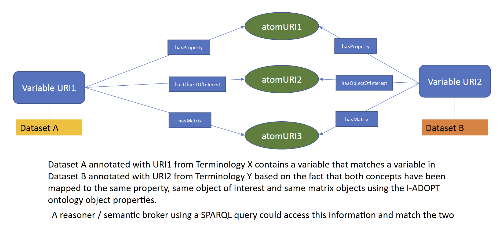
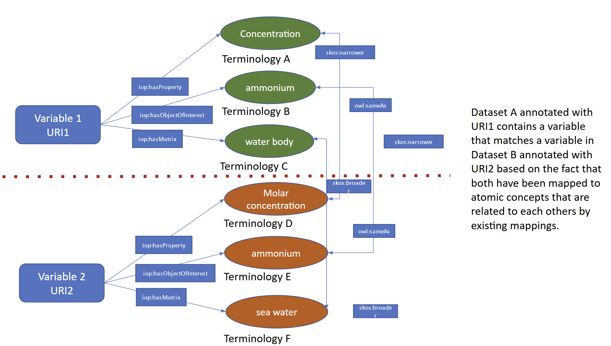
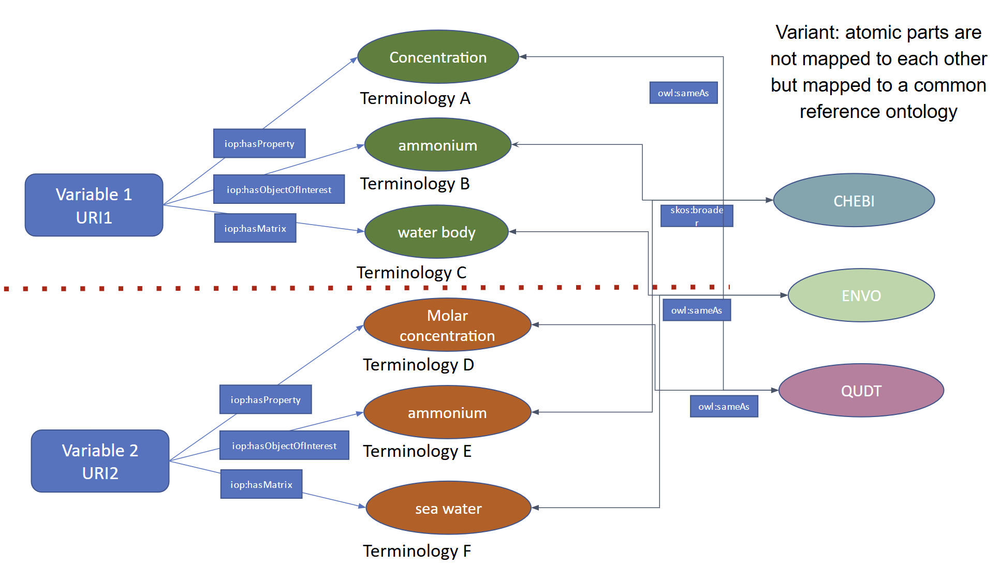
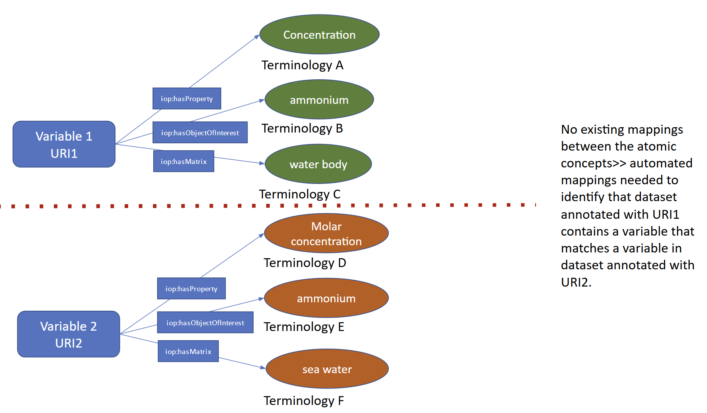
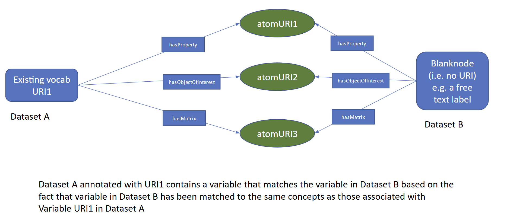

Express which specification was used when mapping in general, but this case study is to be able to express that a mapping has been done based on I-ADOPT

### Domain

Potentially any domain, but with an initinal focus on environmental domain

### Purpose of the mapping

Semantic interoperability, Data integration.

### Other purpose of the mapping

None given.

### Type of mapped resources

- SKOS concepts about variables (observable properties) mapped based on the I-ADOPT Framework ontology. This case study has different user stories:

**Use case 1: direct mappings of description components**

**Use case 2: Indirect mappings of description components**
2a: related mappings of description components:

2b: description components mapped to the same reference semantic artefacts

2 c: no explicit mappings existing, but automatic mappings based on term matches

**Use case 3: Description components mapped between a variable and a blank node**

### Links to an existing mappings

- [https://vocab.nerc.ac.uk/mapping/I/1740186/](https://vocab.nerc.ac.uk/mapping/I/1740186/)

### Tools used for creating the mapping

Manual procedure. We are about developing SQPARQL queries to perform mappings. Alexandra Kokkinaki will provide those.

### Type of mapping relations

- Entity mappings based on the I-ADOPT Framework.

### Examples (samples) of different types of mapping implementations

--
